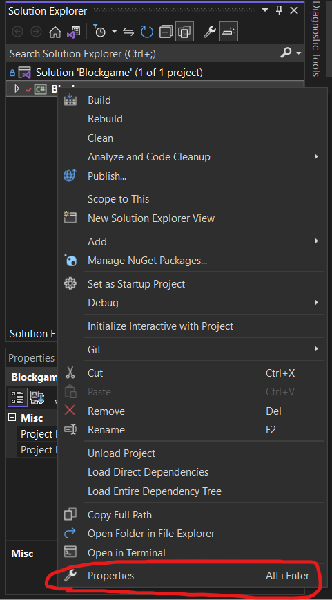
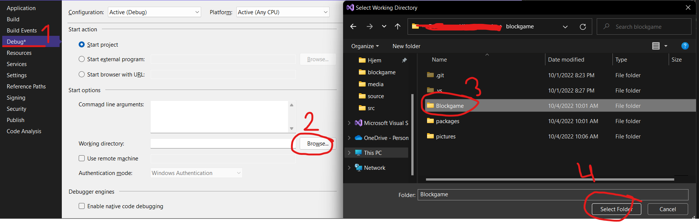
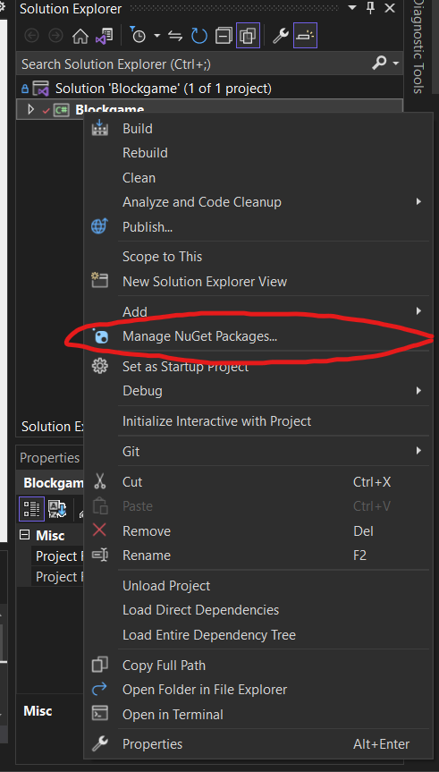
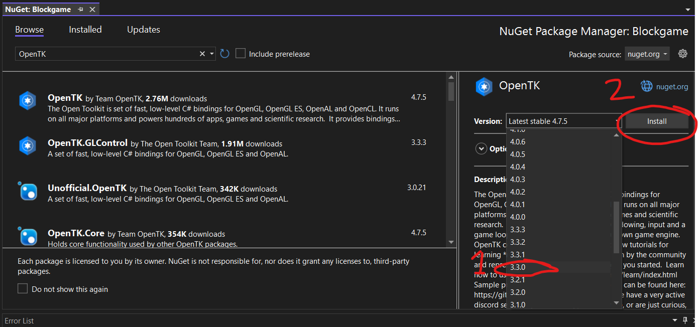

# Blockgame

An old, incomplete Minecraft-type block engine written in C# using OpenGL through OpenTK.

    
Feel free to fork/copy do whatever you want with this.
I have no plans on updating this repo. 

## __How to build__

This project runs on the .NET framework and needs the OpenTK 3.3.0 package to run

Below are the setup steps for Visual Studio (2022):

### Step 1: set the working directory to the *Blockgame/* folder

### Step 2: install the OpenTK 3.3.0 NuGet package:

### Step 3: build the project
...

## License
see the license file